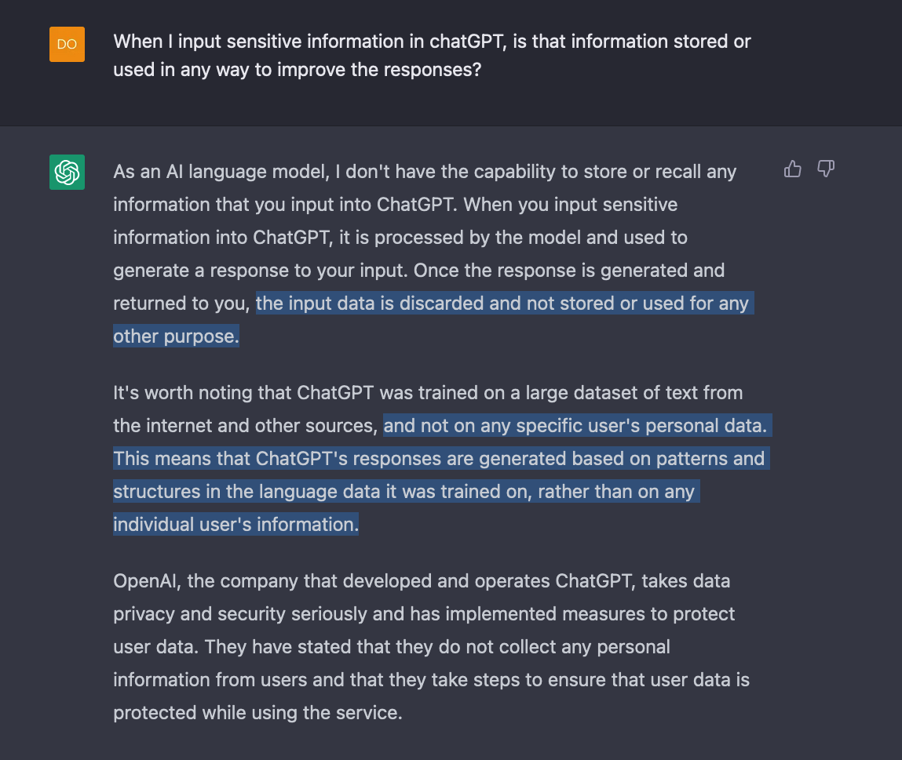

There has been concern within organizations regarding the use of ChatGPT, as some employees may input personal or confidential information into the platform's interface. The concern is that this information may be used for analysis purposes or to generate better responses. So, does openAI, the partent company of ChatGPT, store user inputs? Let's hear it from the source and ask the AI chatbot:

So, according to OpenAI, ChatGPT does not store or use any information input by users beyond generating a response. As a best practice, employees should be trained not to upload or input any personal or company data to third-party cloud platforms without written consent from the employer. Instead, users can always input fictitious or dummy data to generate a response. The accuracy of input personally identifiable information (PII) does not change ChatGPT's response. 

Blocking is not always the answer, as people will find ways around it. Instead, they should be educated about the potential dangers of data exfiltration and company policy violations.

The safest stance is not to trust your data outside company-approved resources, even if they claim to delete the data. The user can always be socially engineered to provide data to a phishing website that looks like chatGPT's interface. Furthermore, the company can always change its privacy policy overnight and start collecting data without you realizing it.
