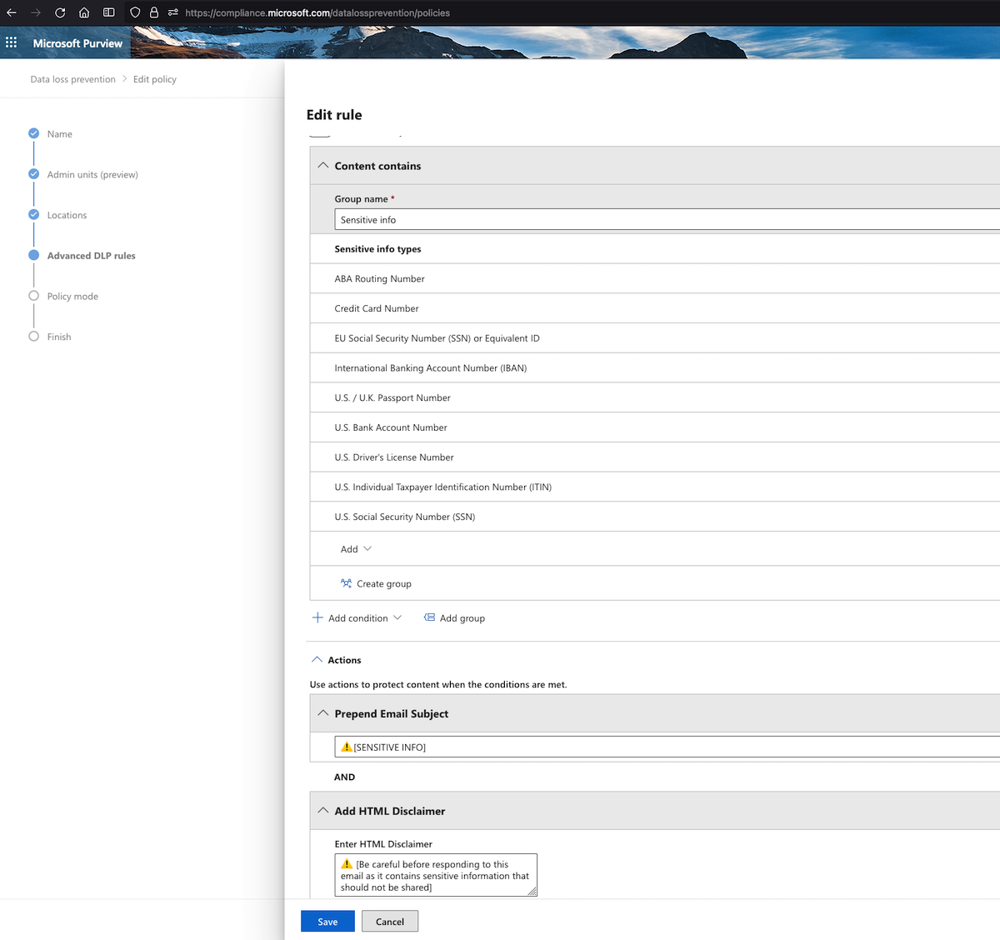

Data security is a top concern in today's digital age. Your email provider's **Data Loss Prevention (DLP)** policy protects against data breaches and *Business Email Compromise* (BEC) attacks.

>**BEC** (Business Email Compromise) is a cybercrime where attackers gain access to a business email account and impersonate employees to deceive others into changing bank account numbers. This leads to fraudulent fund transfers and significant financial losses for the targeted organization.

DLP settings can notify both **senders** and **recipients** about sensitive data sharing, enhancing user awareness. Implementing DLP is easy and allows organizations to block emails with critical information, countering BEC threats effectively.

>DLP settings can be found in most major enterprise email security providers like Microsoft and G-Suite. They often come with a higher-tier license.

### Example
As an example, Microsoft's DLP policy settings in Office 365 can detect things like social security numbers (SSN) in HR emails or bank account details in invoices. It can then inform the recipient in an email banner to take caution before forwarding such emails. Your policy can also be set to block all such emails that include sensitive data and inform the security administrator. This can be taken further to monitor One Drive files and Teams chats as well.

> You can find the O365 DLP policy settings [here:](https://compliance.microsoft.com/datalossprevention/policies)

For organizations at risk of BEC attacks, strict DLP policies can prevent the transmission of sensitive data, neutralizing potential threats and educating users on the dangers of spreading sensitive information using email. However, balancing protection and user convenience is crucial to avoid blocking legitimate emails.

### Phased Approach

As a policy, the company can take a phased approach. The DLP policy can first be set to inform the sender of the security policy and provide better alternatives like:
1. Using encrypted email
2. Using online portals for updating information instead of transmitting it in clear-text email
3. Using secure links to send sensitive files instead of having the files stored in the user's inboxes
Once enough users and 3rd parties have been educated and have implemented secure methods of data transmission, stricter policies can be enforced.

Email security controls pick up a lot of scams and phishing emails, but they are far from perfect. With such visibility and control over sensitive information transmission, most BEC emails that ask for bank details to be changed can easily be caught, especially the ones that fall through the cracks.

### Policy

On top of this technical control (DLP), the organization must add an additional layer to prevent wire transfer fraud in social engineering attacks. At a minimum, the policy should be to change a bank account number with a vendor AFTER an in-person meeting or a video conference call. A grace period should also be a few days before the change is approved. Since emails or phone calls can be spoofed and cloned, they should never be used to validate a critical request like this.
